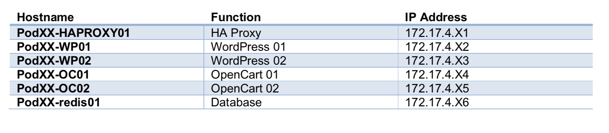
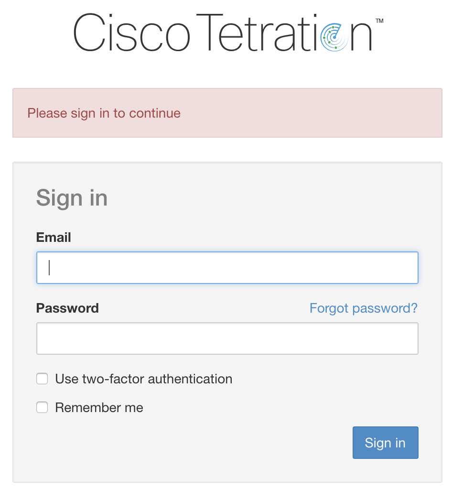
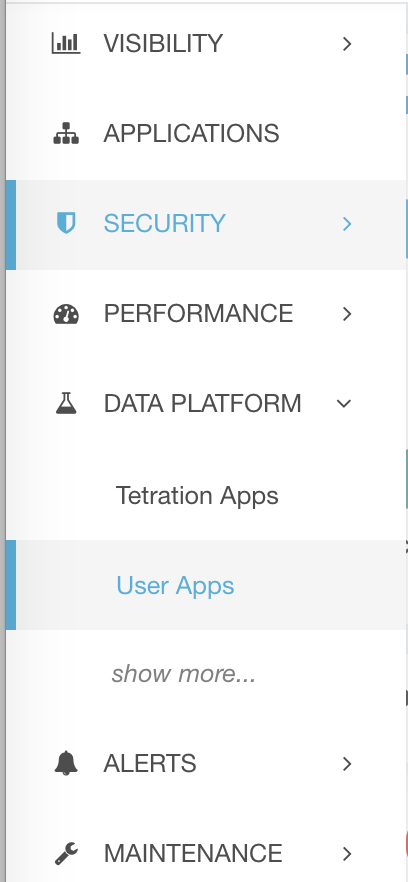
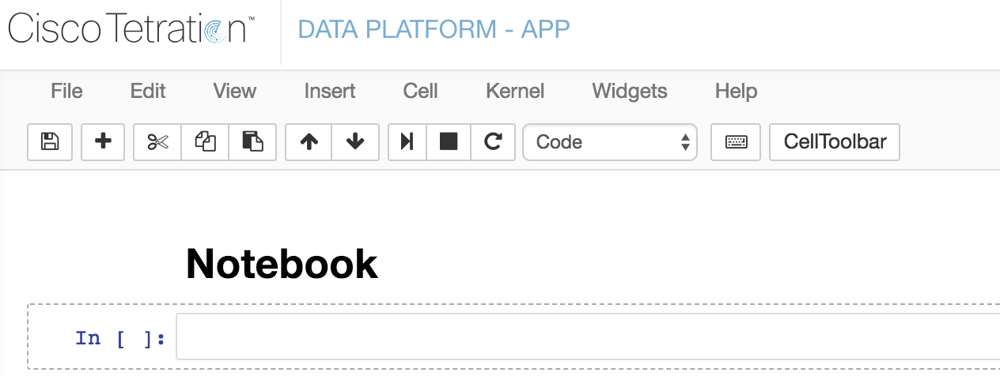
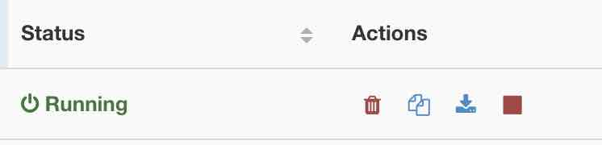
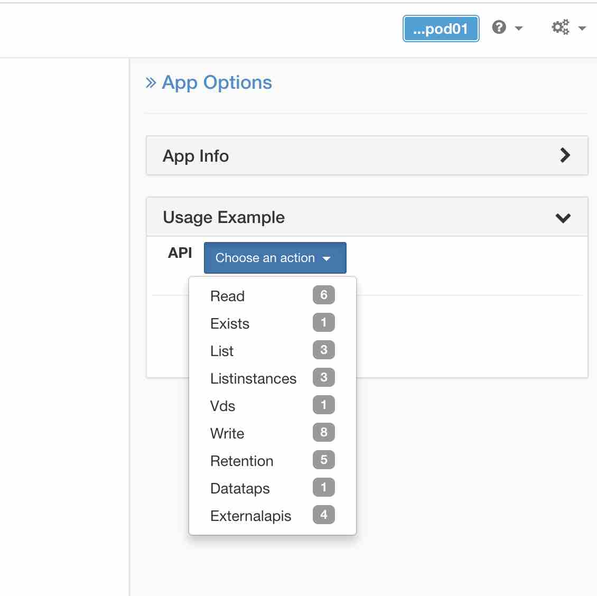
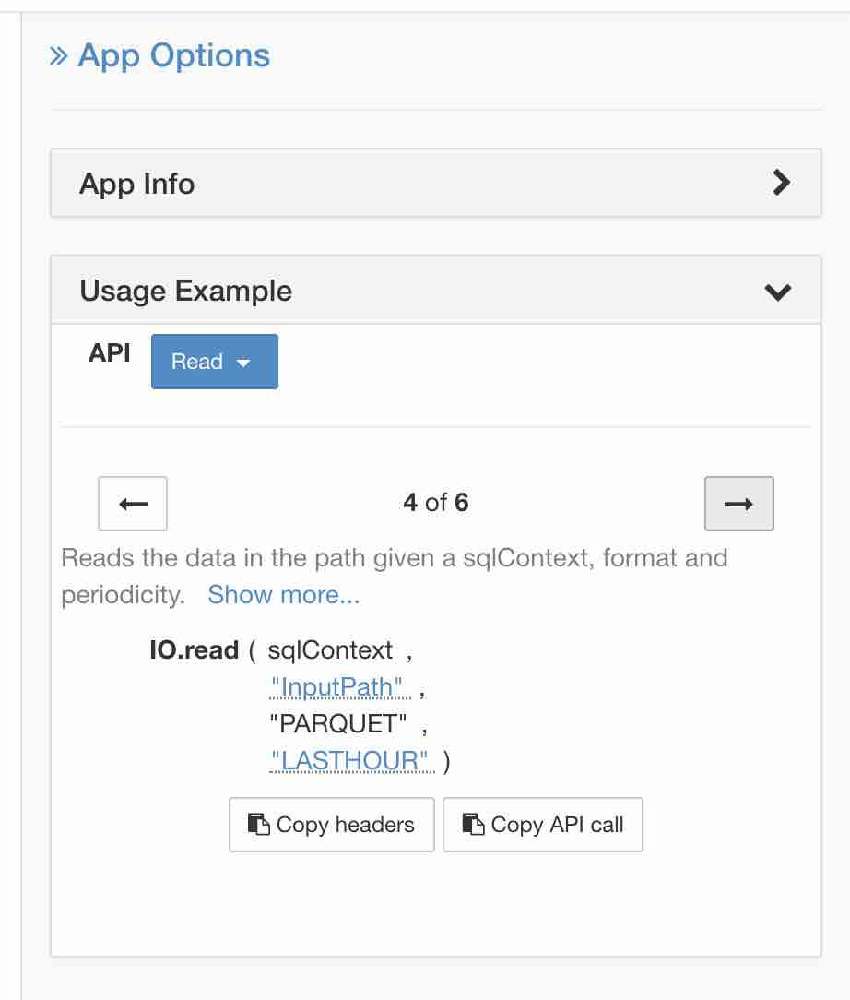

## DEVNET-1270 Lab Guide
____________________________________________________________
# How to exploit the data lake!

## 1. Introduction

The way that Tetration collect the data, give us the opportunity to obtain all the flows in the Data Center. But all the information is store inside the platform by default we used it to give you visibility. But at the same time, you can exploit the data lake using the DATA PLATFORM -APP.
This session will demonstrate how you can start to exploit the data lake very easy, remember DATA = INFORMATION = POWER 
​
## 2. What is a notebook?
Jupyter notebooks are essentially documents that are designed to be easily read by both humans and computers. The elements of a typical notebook include descriptions and analysis, as well as executable code. You can share your code with others and communicate your process and results with a wide array of audiences, from technical to non-technical.
You can try before install it using https://try.jupyter.org/
Select the 'Welcome to Python.ipynb' notebook. To run the notebook first selecting the cell and then use the arrow button. 
For more information refer to the below link:
http://jupyter.readthedocs.io/en/latest/tryjupyter.html
​
### 2.1 Access the notebook in Tetration

The pods are labeled as PODXX, where XX is your POD number. For example, “pod1” is labeled as POD01 and “pod10” is labeled as POD10. For the lab, each Virtual Machine has a software sensor already installed collecting and sending all the telemetry information. 

Each POD has an interface connecting to their own HAProxy, two WordPress VMs and two OpenCart VMs configured as below. Then each POD utilizes a pod shared services tier with MySQL and associated other common services (NFS). There is also another shared services tier for NTP and DNS. In the real-world app owners control policy for their application even if their application has dependencies to other applications.
Here are the IP addresses of the devices that will be used in each POD.

   

1.- Using Chrome navigate to https://perseus-aus.cisco.com and login with the provided credentials
* a. Username: tetperseuspod0X@cisco.com
* b. Password: cl1v3Bar!(


  

2.- Using left navigation pane in Tetration UI, go to Data Platform --> User Apps.
  

3.- In some systems you will find some examples about how you can interact with the platform for your reference, now you need to create a New App in PySpark. Use the name **"Pod0XJNBasic"** and select PySpark

4.- You will enter in your newly created UserApp. Let's have a look at the toolbar and menus:
  

Each cell is an independent block of code, with state, data... 
We can have different kinds of cell for example: 
* Code Cell- Where you can execute code 
* Markdown- You can markdown the notebook to made more nicer

2. In the **first cell**, copy-past this HTML code:   

 ```html

```
 And change the cell type from **Code** to **Markdown**. Run it. 
 Now you can see the image.

Now let’s continue with the coding, normally when starting with a new programming language the first example usually starts with outputting the text 'hello world'

5. In the second **[ ]**, enter:  

 ```
print ("Hi, This is a cell. Press the ▶ button above to run it")
```

6. In the **third[ ]**, enter:  

 ```
# You can change the text below to display a custom message or just execute as is
# Alternative you can run the cell via the 'shift + enter' command
print('hello Cisco Live Barcelona 2019')
```
Like we explian you can put code and also you can call other libraries. Now we want to print number from 1 to 10 we can use diferrent tools. 

7. In the **four [ ]**,enter:
 ```
print_nums()
 ```
8. In the **five[ ]**,enter:

 ```
 # NumPy is a library that can manipulate arrays of data
import numpy as np
g = np.arange( 0, 11, 1 )
print (g)
 ```

**Tip:** It is good coding practice to comment your code. This makes it easier for others to interpret, but can also help you to understand your own intentions and processes when revisiting notebooks at a later stage. Comments can be added by starting the line with the # symbol.

We can now save and exit, **CONGRATS** you create your first Notebook!!

Save using the toolbar "Save and Checkpoint" button.
Using left navigation pane in Tetration UI, go to Data Platform --> User Apps.
Look a the status and buttons of your app:

 

As you did a Checkpoint and your app is still running, you could go back into it.All states are saved, and you could continue incrementing the value between [ ].
Let's save some resources, so **stop your application**. Checkpoint will be deleted.

### 2.2 Enter to the Data Lake
1. Return to the User App Main page, create a NewApp in PySpark. Use the name **"Pod0XJNQueryDL"** using PySpark

In the system, you can for example:
* Pandas is a library for doing data analysis
* NumPy is a library that can manipulate arrays of data
* Matplotlib is used for generating graphs and charts from your data and Folium is a library for building maps.
In this case we will use Pandas and Metplotlib so put this code in the first cell:
 ```
# Import a bunch of useful libraries for manipulating data and plotting data
import pandas as pd
import numpy as np
import matplotlib
import matplotlib.pyplot as plt
matplotlib.style.use('ggplot') 
  ```

2. On the right side, unroll App Options using the blue chevron and look at usage example:

 

To avoid managing a lot of Spark configuration, Tetration UserApps offers you some functions managing that for you.

Click on Read to read data from the Datalake.
There are multiple lists of parameters you can use to query the datalake. Browse them, and stop on option 4 of 6:

  

3. Click on **InputPath** and navigate to Tetration --> Flows **(DO NOT CLICK ON A DATE)**. Then click on **Dismiss** (on the very bottom).

4. Click on **Copy headers** and paste in the empty cell. This code gives you access to Spark (Spark Context) in SparkSQL. Your cell should now look like this:
 ```
import pandas as pd
import numpy as np
import matplotlib
import matplotlib.pyplot as plt
matplotlib.style.use('ggplot') 
# Simple read based on the py _sql context
from pyspark.sql import SQLContext
sqlContext = SQLContext(sc)
 ```
5. Click on Copy API call and past in the same cell. Hide the App Option panel with the chevrons. This code returns the Spark main object called RDD (Resilient Distributed Dataset). Add **.registerTempTable("FlowsDL")** in the end so your cell should now look like:
 ```
# Import a bunch of useful libraries for manipulating data and plotting data
import pandas as pd
import numpy as np
import matplotlib
import matplotlib.pyplot as plt
matplotlib.style.use('ggplot') 
# Simple read based on the py _sql context
from pyspark.sql import SQLContext
sqlContext = SQLContext(sc)
sc._jvm.com.tetration.apps.IO.read(sqlContext._ssql_ctx, "/tetration/flows", "PARQUET", "LASTHOUR").registerTempTable("FlowsDL")
 ```
This tells Spark to create a "SQL Table" (like an Excel sheet) called "FlowsDL" that we will manipulate in Spark SQL.

Run this cell, that contains all the structures we will then manipulate multiple times. No output is expected.

6. Add a new cell. Now we want to collect just 3 lines of information in the database, put this code and run it:
 ```
my_query = sqlContext.sql("SELECT * FROM FlowsDL LIMIT 3")
 ```
 
If you modify the number 3 for 5 you can increase the number of data you are extracting to the table. Modify the number and running again.
 
7. We can take a look at the structure of the DataFrame and some sample data by calling the head() function. Add a new cell and put this code
  ```
my_query.head()
   ```
8. But this is not so clear, we will try with pandas aggregate another cell and put this code:

  ```
 my_query.toPandas()
   ```
Remember that you can also put a number inside the () to indicated how many data you want to read
  
9. If you want to understood  what kind of data is available in the system. Please add a new cell (as we got data and don't want to recollect it), and run this code in it:

  ```
 list(my_query)
   ```
You have now the list of the fields available in the flows Datalake you can use!
**Remember:** Let's save some resources, so **stop your application**.

### 2.3 Understood Data

Depending of the information you want to obtain, Tetration has different tables that you can use. Now we will understand the different kind of data you can obtain. 

1. Return to the User App Main page, create a NewApp in PySpark. Use the name **"Pod0XDataT"** using PySpark
 
2. Put this code in the first cell:
 ```
# Import a bunch of useful libraries for manipulating data and plotting data
import pandas as pd
import numpy as np
import matplotlib
import matplotlib.pyplot as plt
matplotlib.style.use('ggplot') 
# Read based on the py _sql context
from pyspark.sql import SQLContext
sqlContext = SQLContext(sc)
  ```

3. Imagine that you want to know the number or OS that you have in the network, for that we need to create another table in this case using **/tetration/machine/** and we want to print the table
 ``` 
machine_data = sc._jvm.com.tetration.apps.IO.read(sqlContext._ssql_ctx, "/tetration/machine/", "PARQUET", "LAST24HOURS").registerTempTable("machines")
machines_24h = sqlContext.sql("select * from machines")
machines_24h.limit(5).toPandas()
 ```
 
 4. In other cell, put the following command to review the type of data you can obtain
  ``` 
 list(machines_24h)
  ``` 
 5. Now we want to graphic the OS devices using metasploit. First, we need to create the os_counts, in another cell put: 
 
   ``` 
 # WARNING:  If dataset is too large, toPandas() may cause problems
os_counts = machines_24h.toPandas().groupby(["os", "os_version"])
host_os_counts = os_counts['hostname'].agg({'count': len, 'unique_hostname': pd.Series.nunique})
host_os_counts
  ``` 
6. To create the graph, in another cell put:
  ``` 
%matplotlib inline
# Show the same data in graphical format
axes = host_os_counts.plot(kind='barh', title="Counts by OS and OS_version", subplots=True, sharey=True, sharex=False, layout=(1, 2), rot=0)
for label in axes[0][0].get_xmajorticklabels():
    label.set_rotation(30)
    label.set_horizontalalignment("center")
  ``` 
7. If you want to obtain data regarding the inventory of the systems we need to create a new table, in this case using **/tetration/inventory/**. Add the following commands in the new cell
  ``` 
inventory_data = sc._jvm.com.tetration.apps.IO.read(sqlContext._ssql_ctx, "/tetration/inventory/", "PARQUET", "LAST24HOURS").registerTempTable("inventory24h")
inventory_24h = sqlContext.sql("select * from inventory24h")
inventory_24h.limit(5).toPandas()
  ``` 
8. In other cell, put the following command to review the type of data you can obtain
  ``` 
 list(machines_24h)
  ``` 
9. If you want to obtain data for shallow flows you can use **"/tetration/shallowflows"**.Add the following commands in the new cell
  ``` 
sc._jvm.com.tetration.apps.IO.read(sqlContext._ssql_ctx, "/tetration/shallowflows", "PARQUET", "LASTHOUR").registerTempTable("shallowflows24h")
shallow_24h = sqlContext.sql("select * from shallowflows24h")
shallow_24h.limit(5).toPandas()
   ``` 
If you see we have the same columns than the **"/tetration/flows"** but the data is different because this are the shallow flows.
**Remember:** Let's save some resources, so **stop your application**.

### 2.3 Process Data

Now we want to manipulate some data, we want to review the flows from one of our servers we will use source IP address 172.17.4.23.  Create a new notebook 

1. We need to create the table to work, in the cell put:
  ``` 
from pyspark.sql import SQLContext
sqlContext = SQLContext(sc)
sc._jvm.com.tetration.apps.IO.read(sqlContext._ssql_ctx, "/tetration/flows", "PARQUET", "LASTHOUR").registerTempTable("flows")
threshold = 10
  ``` 
Run this cell, and add a new cell. 
2. Here we will modify the table that we want to use and the specific IP Address. This is our main data. As we will use it multiple times, we will ask Spark to cache it. Otherwise, Spark will rebuild the complete query each time and start be looking at all data in HDFS... 
**Put this code in the empty cell and run it:**
  ``` 
# Searching for all the connections for the 172.17.4.X3 remember the x is your pod number
specific_ip = sqlContext.sql("SELECT src_address AS source, dst_address AS destination, dst_port AS port, fwd_pkts, fwd_syn_count, rev_pkts, rev_rst_count FROM flows WHERE src_address = '172.17.4.X3'")
specific_ip.persist(storageLevel=StorageLevel.MEMORY_AND_DISK)
specific_ip.toPandas()
  ``` 
Only last line requires Spark to execute the query (returning a Pandas Dataframe).

3. Now, we will remove duplicate entries. Add a new cell and paste this code and run it:
# Removing duplicates entries
specific_ip_cleaned = specific_ip.dropDuplicates(['source','destination','port'])
specific_ip_cleaned.toPandas()
You noticed that .toPandas() is always in the end: returning data centrally is the last step, we want Spark to do all the other operations in a distributed way.

4. Now we will modify the view and select not just source address also ports
 
``` 
# Searching for all the connections for the 172.17.4.X3 remember the x is your pod number I will use pod 2 for this example
specific_soudes = sqlContext.sql("SELECT src_address AS source, dst_address AS destination, dst_port AS port, fwd_pkts, fwd_syn_count, rev_pkts, rev_rst_count FROM flows WHERE src_address = '172.17.4.23' AND dst_address = '172.17.4.3'")
specific_soudes.persist(storageLevel=StorageLevel.MEMORY_AND_DISK)
specific_soudes.toPandas()
``` 

## Conclusion

Cisco Tetration User Apps gives you the POWER OF THE DATA. We explain: 
* How Accessing Tetration Datalake
* Explain available data
* Processing this data in your own way

### If you want to:
* Send a message to Kafka
* Combine external data with Tetration Datalake

Review the following session DEVWKS-2612 Tetration UserApps, Augment the Platform!
